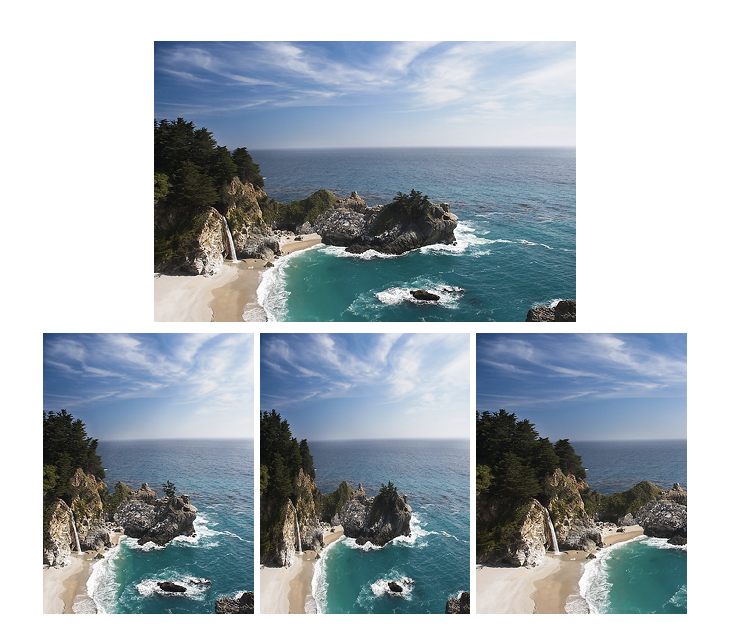

# Content-Aware Image Resizer

A C++ implementation of the seam carving algorithm for content-aware image resizing. Instead of uniform scaling or cropping, the program identifies and removes low-energy paths through the image, preserving visually important content like edges and subjects.

Based on the paper [Seam Carving for Content-Aware Image Resizing](http://graphics.cs.cmu.edu/courses/15-463/2007_fall/hw/proj2/imret.pdf) by Avidan & Shamir (2007).

## Demo Video

[](https://www.youtube.com/watch?v=qadw0BRKeMk)

<!-- Add a GIF here showing seam removal in real time, e.g.:

Tip: record your terminal with asciinema or screen-capture the program running with display=1 -->

## Results




## How It Works

The algorithm runs the following pipeline once per seam removed:

1. **Energy Computation** — Each pixel is scored by importance using its four cardinal neighbors (N/S/E/W):

   ```
   energy(r, c) = squared_diff(North, South) + squared_diff(West, East)
   ```

   Border pixels, which lack one or more neighbors, are assigned the maximum energy found in the image so they are never chosen for removal.

2. **Cost Matrix** — Dynamic programming accumulates the minimum-energy cost to reach each pixel from the top row:

   ```
   cost(r, c) = energy(r, c) + min(cost(r-1, c-1), cost(r-1, c), cost(r-1, c+1))
   ```

3. **Seam Identification** — Starting from the lowest-cost pixel in the bottom row, the algorithm backtracks upward always picking the minimum-cost predecessor. Ties are broken by choosing the leftmost option.

4. **Seam Removal** — The identified vertical seam is removed row-by-row, producing an image one pixel narrower.

5. **Iteration** — Steps 1–4 repeat until the target width is reached. For height reduction, the image is rotated 90°, width-carved, then rotated back.

## Project Structure

```
Content-Aware-Image-Resizer/
├── src/
│   ├── Matrix.h / Matrix.cpp       # 2D matrix data structure
│   ├── Image.h  / Image.cpp        # PPM image representation
│   ├── processing.h / processing.cpp  # Energy map, seam finding & removal
│   └── resize.cpp                  # Entry point / CLI
├── tests/                          # Public and custom test suites
├── Makefile
└── README.md
```

## Prerequisites

- C++ compiler supporting C++11 (`g++` or `clang++`)
- `make`
- Input images in **PPM format**

## Building

```bash
git clone https://github.com/felixlu4725/Content-Aware-Image-Resizer.git
cd Content-Aware-Image-Resizer
make resize.exe
```

## Usage

```bash
./resize.exe <input.ppm> <output.ppm> <new_width> [new_height]
```

| Argument | Description |
|---|---|
| `input.ppm` | Path to the source PPM image |
| `output.ppm` | Path for the resized output image |
| `new_width` | Target width in pixels (≤ original width) |
| `new_height` | *(Optional)* Target height in pixels (≤ original height) |

### Example

```bash
./resize.exe dog.ppm dog_small.ppm 400 300
```

## Running Tests

```bash
make test
```

This builds and runs the full test suite, including public tests for `Matrix`, `Image`, and `processing`, plus a regression check against a reference output.

## Algorithm Details

| Component | Approach |
|---|---|
| Energy function | Dual-gradient — squared RGB differences of N/S and E/W neighbors |
| Border pixels | Assigned max energy to prevent border removal |
| Cost matrix | Row-major DP accumulation from top row |
| Tie-breaking | Leftmost minimum-cost predecessor chosen |
| Horizontal resizing | 90° rotation + vertical seam removal + rotation back |
| Image format | PPM (Portable Pixmap) |
| Recommended max input | ~1000×1000 px (seam carving is O(w×h) per seam) |

---

By Felix Lu — felixlu@umich.edu
